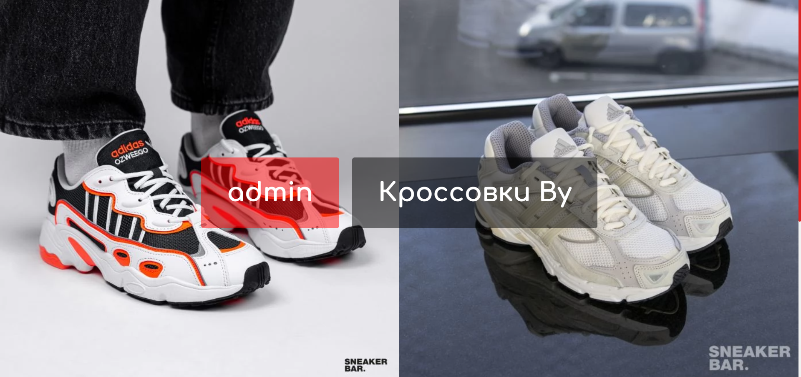
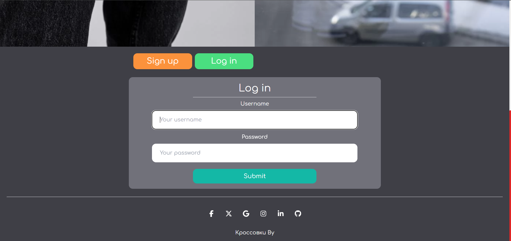
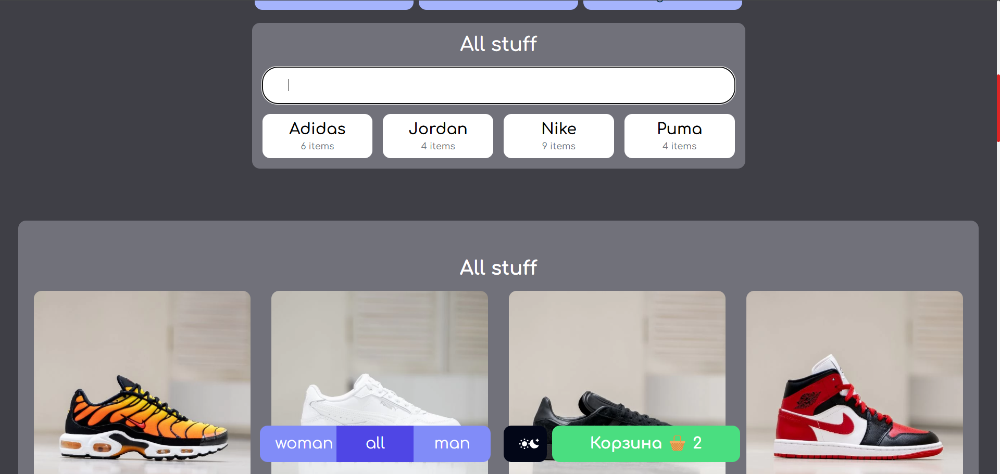
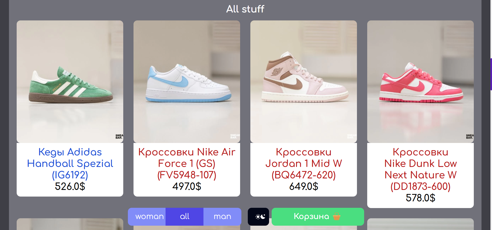
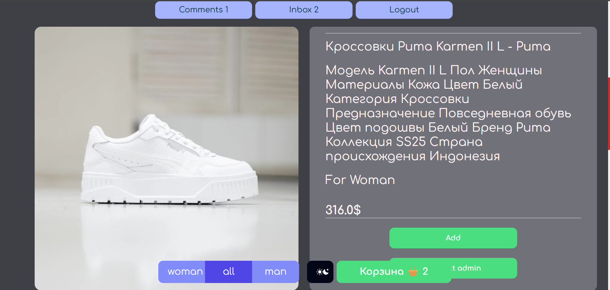
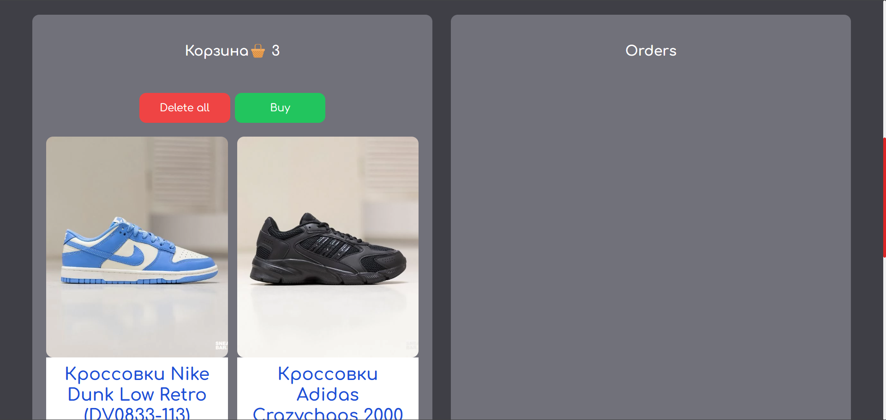
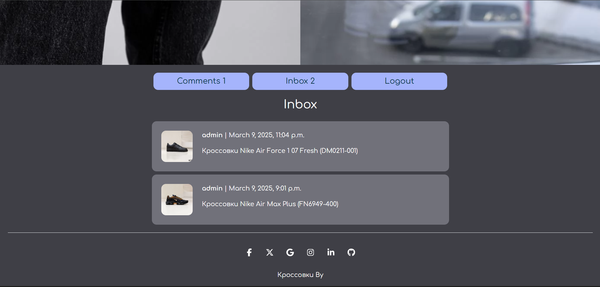
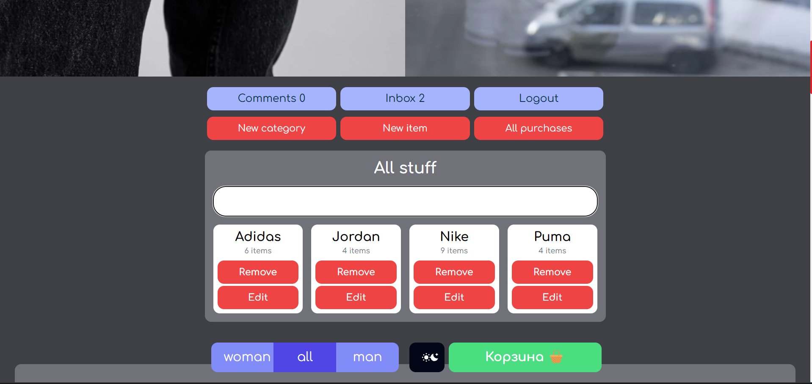

#  Кроссовки By

**Интернет-магазин**

Цель проекта – разработка веб-приложения для просмотра товаров с базовой и детальной информацией, добавления товаров в корзину и совершения покупок (без подключения платёжной системы). При этом:

- **Покупку и добавление в корзину** могут осуществлять только залогиненные пользователи.
- **Добавление/удаление товаров** в систему доступно только администратору.

---

## Требования

1. **Фреймворк:**  
   Выбрать один из:
   - Django
   - Flask
   - FastAPI
   - Aiohttp

2. **СУБД:**  
   Выбрать одну из:
   - MySQL
   - PostgreSQL
   - MongoDB

3. **Аутентификация:**  
   Реализовать регистрацию и вход с использованием:
   - Session
   - Access Token
   - JWT

4. **Обработка исключений:**  
   Каждый исключительный случай должен возвращать ответ с соответствующим статусом.

5. **Валидация данных:**  
   Перед сохранением или обновлением данные от пользователя необходимо валидировать. В случае ошибок вернуть ответ с подробными сообщениями для каждого неверного поля.

6. **Тестирование:**  
   Добавить unit- и интеграционные тесты.

---

## Используемые технологии

- **Backend:** Django  
  - Django-Session  
  - Django-Admin  
  - Django-Test

- **База данных:** PostgreSQL

- **Frontend:**  
  - tailwindcss  
  - HTML / CSS / JS  
  - Jinja

- **Код-стайл:**  
  - Ruff (линтинг, форматирование)

---

## Интерфейс и функциональность

### 1. Login, Signup

---

### 2. Home – Категории, Товары, Поиск, Фильтр (Woman/Man)
  

---

### 3. Detail Item
- **Функции:**
  - Добавление/удаление товара в корзину
  - Контакт с продавцом
  - Просмотр связанных товаров
  - Добавление комментариев

---

### 4. Busket (Корзина)
- **Функции:**
  - Удаление товара
  - Очистка корзины
  - Покупка товара
  - Просмотр списка заказов
  - Отмена заказа

---

### 5. Дополнительные функции для авторизованных пользователей
- **Функции:**
  - Просмотр списка комментариев
  - Просмотр списка переписок

---

### 6. Административный интерфейс
- **Функции:**
  - Добавление, удаление и редактирование категорий и товаров
  - Просмотр всех покупок пользователей

